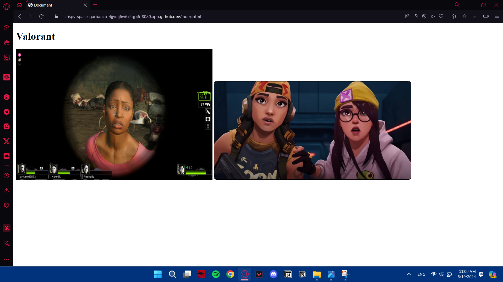

# Net&Sys Assignment: Running Containers for Application Development

Group Name: __Fill your team name__. 

Team Mates:
1. FARHAN HAIKAL BIN HISHAMUDDIN 2219173
2. AISAR NASRUN BIN RAMJEE 2216791
3. HARIS IRFAN BIN HASNIZAM 2210555
## Rules
1. You are allowed to have **3 group** members.
2. When you complete the assignment, make sure to submit the repository link of your cloned project. Make sure all the files are as what you aspect in your repository. 
3. Answer all questions in the **README.md**, in your own repository. Either use the online VSCode, terminal or github to edit. Answers are expected where you see __Fill answer here__.
4. Learn how to use markdown. https://www.w3schools.io/file/markdown-introduction/

## Forking this project repository
1. First thing you need in doing this assignment is to have a github account. Make sure to sign up at https://www.github.com
2. The second thing you need is to fork the Net&Sys Assignment repository in your own github account. 

    1. Go to https://github.com/ZainabBashi/NatSysProject and click fork to copy the project into your own repository
    2. Make sure that the new fork is now in your own repository

***Questions:***

1. What is the link of the fork Net&Sys Assignment in your repository. ***(1 mark)*** __Fill answer here__.
https://github.com/FarhanHaikalHishamuddin/NatSysProject
2. How many files and folders are in this repository. ***(1 mark)*** __Fill answer here__.
1 folders and 7 files.


## Exploring github codespaces

1. The next thing that we will be doing is exploring codespaces. First of all, read about codespaces https://docs.github.com/en/codespaces/overview#what-is-a-codespace
2. Then go to the link https://github.com/codespaces and we shall start a new codespace.  
3. Click on ***New codespace***.
4. Choose your own Net&Sys Assignment repository to start your codespace.

 

5. Once you have created you codespace, you will see the following. You might already be familiar with this, since it will look similar to VSCode. 

 

6. You will see the [README file](./README.md) file. One is a preview of how it looks like on the web, and the other is the editing view in markdown language. 
7. Edit the [README file](./README.md). Make sure you have your group details correct, ie, group name and team members along with their matric Numbers. 
8. Once you have finish editing, click File->Save or ***ctrl-s*** to save it. 
9. After saving, you will notice an M or U next to your file. You will need to commit any changes, whenever you make changes so that it is uploaded to the github repository. 

 

10. Click on the source control, hint: its on the left side panel, and it will list down the files that have been modified or updated. Click on commit. It will then ask you "Would you like to stage all your changes and commit them directly?" Just say yes, and a new tab will appear. Type a message to log what you have done, and click on the check mark. 

 

11. After that, sync the changes to the main repository. 
12. Make sure to commit and sync your files to the main repository, or else, your work will be lost since it is not saved into the main repository when you submit your project.

***Questions:***

1. What is default OS used to run the virtual environment for codespaces. ***(1 mark)*** __UBUNTU__.
2. What are the two options of RAM, disk and vcpu configuration you can have in running codespaces . ***(1 mark)*** 

2-core vCPU, 8 GB RAM, 32 GB disk,

  4-core vCPU, 16 GB RAM, 64 GB disk.

3. Why must we commit and sync our current work on source control? ***(1 mark)*** __To make sure our work will be save into the main repository.__.

## Exploring the Terminal

1. Look at the TERMINAL tab. Explore and run commands according to the questions below. 
2. You can include your answers as images, or cut and paste the output here. If you are cutting and pasting your answers, wrap your answers in the codeblock clause in markdown. For example, if i run the command **whoami** the the output would look like the one below.
```bash
@joeynor ➜ /workspaces/OSProject (main) $ whoami 
codespace
```


***Questions:***

Look at the TERMINAL tab. Run the following commands and provide the output here. 

1. Run the command **pwd** . ***(1 mark)*** __Fill answer here__.
```bash
@FarhanHaikalHishamuddin ➜ /workspaces/NatSysProject (main) $ pwd
/workspaces/NatSysProject
```
2. Run the command **cat /etc/passwd** . ***(1 mark)*** __Fill answer here__.
```bash
@FarhanHaikalHishamuddin ➜ /workspaces/NatSysProject (main) $ cat /etc/passwd
root:x:0:0:root:/root:/bin/bash
daemon:x:1:1:daemon:/usr/sbin:/usr/sbin/nologin
bin:x:2:2:bin:/bin:/usr/sbin/nologin
sys:x:3:3:sys:/dev:/usr/sbin/nologin
sync:x:4:65534:sync:/bin:/bin/sync
games:x:5:60:games:/usr/games:/usr/sbin/nologin
man:x:6:12:man:/var/cache/man:/usr/sbin/nologin
lp:x:7:7:lp:/var/spool/lpd:/usr/sbin/nologin
mail:x:8:8:mail:/var/mail:/usr/sbin/nologin
news:x:9:9:news:/var/spool/news:/usr/sbin/nologin
uucp:x:10:10:uucp:/var/spool/uucp:/usr/sbin/nologin
proxy:x:13:13:proxy:/bin:/usr/sbin/nologin
www-data:x:33:33:www-data:/var/www:/usr/sbin/nologin
backup:x:34:34:backup:/var/backups:/usr/sbin/nologin
list:x:38:38:Mailing List Manager:/var/list:/usr/sbin/nologin
irc:x:39:39:ircd:/var/run/ircd:/usr/sbin/nologin
gnats:x:41:41:Gnats Bug-Reporting System (admin):/var/lib/gnats:/usr/sbin/nologin
nobody:x:65534:65534:nobody:/nonexistent:/usr/sbin/nologin
_apt:x:100:65534::/nonexistent:/usr/sbin/nologin
systemd-timesync:x:101:101:systemd Time Synchronization,,,:/run/systemd:/usr/sbin/nologin
systemd-network:x:102:103:systemd Network Management,,,:/run/systemd:/usr/sbin/nologin
systemd-resolve:x:103:104:systemd Resolver,,,:/run/systemd:/usr/sbin/nologin
messagebus:x:104:105::/nonexistent:/usr/sbin/nologin
codespace:x:1000:1000::/home/codespace:/bin/bash
sshd:x:105:65534::/run/sshd:/usr/sbin/nologin
```
3. Run the command **df** . ***(1 mark)*** __Fill answer here__.
```bash
@FarhanHaikalHishamuddin ➜ /workspaces/NatSysProject (main) $ df
Filesystem     1K-blocks     Used Available Use% Mounted on
overlay         32847680 10408800  20744780  34% /
tmpfs              65536        0     65536   0% /dev
shm                65536        0     65536   0% /dev/shm
/dev/root       30298176 24090484   6191308  80% /vscode
/dev/sda1       46127956      132  43752248   1% /tmp
/dev/loop3      32847680 10408800  20744780  34% /workspaces
```
4. Run the command **du** . ***(1 mark)*** __Fill answer here__.
```bash
@FarhanHaikalHishamuddin ➜ /workspaces/NatSysProject (main) $ du
4       ./.git/branches
8       ./.git/objects/b3
8       ./.git/objects/1b
8       ./.git/objects/83
8       ./.git/objects/47
8       ./.git/objects/71
12      ./.git/objects/62
8       ./.git/objects/90
8       ./.git/objects/58
12      ./.git/objects/73
8       ./.git/objects/a6
8       ./.git/objects/04
8       ./.git/objects/fd
12      ./.git/objects/e5
8       ./.git/objects/41
8       ./.git/objects/7b
8       ./.git/objects/24
8       ./.git/objects/c6
12      ./.git/objects/3d
8       ./.git/objects/0b
12      ./.git/objects/72
12      ./.git/objects/d2
16      ./.git/objects/a1
8       ./.git/objects/86
8       ./.git/objects/5b
12      ./.git/objects/1c
8       ./.git/objects/eb
8       ./.git/objects/ab
12      ./.git/objects/ff
12      ./.git/objects/af
8       ./.git/objects/74
8       ./.git/objects/96
12      ./.git/objects/70
8       ./.git/objects/d8
8       ./.git/objects/91
8       ./.git/objects/c3
8       ./.git/objects/3a
12      ./.git/objects/17
8       ./.git/objects/4e
12      ./.git/objects/2e
16      ./.git/objects/0d
8       ./.git/objects/52
8       ./.git/objects/fc
8       ./.git/objects/e7
16      ./.git/objects/fb
8       ./.git/objects/fa
8       ./.git/objects/4b
8       ./.git/objects/f9
12      ./.git/objects/6e
12      ./.git/objects/b5
8       ./.git/objects/49
8       ./.git/objects/60
8       ./.git/objects/fe
8       ./.git/objects/20
8       ./.git/objects/f6
8       ./.git/objects/3f
16      ./.git/objects/a3
12      ./.git/objects/4d
8       ./.git/objects/cd
8       ./.git/objects/f2
8       ./.git/objects/b2
8       ./.git/objects/93
8       ./.git/objects/81
8       ./.git/objects/22
8       ./.git/objects/e9
8       ./.git/objects/cb
12      ./.git/objects/64
8       ./.git/objects/b9
8       ./.git/objects/b6
8       ./.git/objects/4f
8       ./.git/objects/4a
4       ./.git/objects/info
12      ./.git/objects/14
1824    ./.git/objects/pack
8       ./.git/objects/43
12      ./.git/objects/44
2520    ./.git/objects
8       ./.git/logs/refs/heads
12      ./.git/logs/refs/remotes/origin
16      ./.git/logs/refs/remotes
28      ./.git/logs/refs
36      ./.git/logs
68      ./.git/hooks
4       ./.git/lfs/tmp
8       ./.git/lfs
4       ./.git/refs/tags
8       ./.git/refs/heads
12      ./.git/refs/remotes/origin
16      ./.git/refs/remotes
32      ./.git/refs
8       ./.git/info
2712    ./.git
1972    ./images
4704    .
```
5. Run the command **ls** . ***(1 mark)*** __Fill answer here__.
```bash
@FarhanHaikalHishamuddin ➜ /workspaces/NatSysProject (main) $ ls
README.md  images
```
6. Run the command **ls -asl** . ***(1 mark)*** __Fill answer here__.
```bash
@FarhanHaikalHishamuddin ➜ /workspaces/NatSysProject (main) $ ls -asl
total 36
 4 drwxrwxrwx+ 4 codespace root  4096 Jun 16 11:34 .
 4 drwxr-xrwx+ 5 codespace root  4096 Jun 16 11:34 ..
 4 drwxrwxrwx+ 9 codespace root  4096 Jun 16 13:26 .git
20 -rw-rw-rw-  1 codespace root 17480 Jun 16 13:45 README.md
 4 drwxrwxrwx+ 2 codespace root  4096 Jun 16 11:34 images
 ```
7. Run the command **free -h** . ***(1 mark)*** __Fill answer here__.
```bash
@FarhanHaikalHishamuddin ➜ /workspaces/NatSysProject (main) $ free -h
              total        used        free      shared  buff/cache   available
Mem:          7.7Gi       1.4Gi       171Mi        65Mi       6.2Gi       5.9Gi
Swap:            0B          0B          0B
```
8. Run the command **cat /proc/cpuinfo** . ***(1 mark)*** __Fill answer here__.
```bash
@FarhanHaikalHishamuddin ➜ /workspaces/NatSysProject (main) $ cat /proc/cpuinfo
processor       : 0
vendor_id       : AuthenticAMD
cpu family      : 25
model           : 1
model name      : AMD EPYC 7763 64-Core Processor
stepping        : 1
microcode       : 0xffffffff
cpu MHz         : 3241.052
cache size      : 512 KB
physical id     : 0
siblings        : 2
core id         : 0
cpu cores       : 1
apicid          : 0
initial apicid  : 0
fpu             : yes
fpu_exception   : yes
cpuid level     : 13
wp              : yes
flags           : fpu vme de pse tsc msr pae mce cx8 apic sep mtrr pge mca cmov pat pse36 clflush mmx fxsr sse sse2 ht syscall nx mmxext fxsr_opt pdpe1gb rdtscp lm constant_tsc rep_good nopl tsc_reliable nonstop_tsc cpuid extd_apicid aperfmperf pni pclmulqdq ssse3 fma cx16 pcid sse4_1 sse4_2 movbe popcnt aes xsave avx f16c rdrand hypervisor lahf_lm cmp_legacy svm cr8_legacy abm sse4a misalignsse 3dnowprefetch osvw topoext invpcid_single vmmcall fsgsbase bmi1 avx2 smep bmi2 erms invpcid rdseed adx smap clflushopt clwb sha_ni xsaveopt xsavec xgetbv1 xsaves clzero xsaveerptr rdpru arat npt nrip_save tsc_scale vmcb_clean flushbyasid decodeassists pausefilter pfthreshold v_vmsave_vmload umip vaes vpclmulqdq rdpid fsrm
bugs            : sysret_ss_attrs null_seg spectre_v1 spectre_v2 spec_store_bypass srso
bogomips        : 4890.86
TLB size        : 2560 4K pages
clflush size    : 64
cache_alignment : 64
address sizes   : 48 bits physical, 48 bits virtual
power management:

processor       : 1
vendor_id       : AuthenticAMD
cpu family      : 25
model           : 1
model name      : AMD EPYC 7763 64-Core Processor
stepping        : 1
microcode       : 0xffffffff
cpu MHz         : 3241.124
cache size      : 512 KB
physical id     : 0
siblings        : 2
core id         : 0
cpu cores       : 1
apicid          : 1
initial apicid  : 1
fpu             : yes
fpu_exception   : yes
cpuid level     : 13
wp              : yes
flags           : fpu vme de pse tsc msr pae mce cx8 apic sep mtrr pge mca cmov pat pse36 clflush mmx fxsr sse sse2 ht syscall nx mmxext fxsr_opt pdpe1gb rdtscp lm constant_tsc rep_good nopl tsc_reliable nonstop_tsc cpuid extd_apicid aperfmperf pni pclmulqdq ssse3 fma cx16 pcid sse4_1 sse4_2 movbe popcnt aes xsave avx f16c rdrand hypervisor lahf_lm cmp_legacy svm cr8_legacy abm sse4a misalignsse 3dnowprefetch osvw topoext invpcid_single vmmcall fsgsbase bmi1 avx2 smep bmi2 erms invpcid rdseed adx smap clflushopt clwb sha_ni xsaveopt xsavec xgetbv1 xsaves clzero xsaveerptr rdpru arat npt nrip_save tsc_scale vmcb_clean flushbyasid decodeassists pausefilter pfthreshold v_vmsave_vmload umip vaes vpclmulqdq rdpid fsrm
bugs            : sysret_ss_attrs null_seg spectre_v1 spectre_v2 spec_store_bypass srso
bogomips        : 4890.86
TLB size        : 2560 4K pages
clflush size    : 64
cache_alignment : 64
address sizes   : 48 bits physical, 48 bits virtual
power management:
```
9. Run the command **top** and type **q** to quit. ***(1 mark)*** __Fill answer here__.
```bash
processor       : 1
vendor_id       : AuthenticAMD
cpu family      : 25
model           : 1
model name      : AMD EPYC 7763 64-Core Processor
stepping        : 1
microcode       : 0xffffffff
cpu MHz         : 3241.124
cache size      : 512 KB
physical id     : 0
siblings        : 2
core id         : 0
cpu cores       : 1
apicid          : 1
initial apicid  : 1
fpu             : yes
fpu_exception   : yes
cpuid level     : 13
top - 13:49:21 up  1:27,  0 users,  load average: 0.08, 0.15, 0.14
Tasks:  17 total,   1 running,  16 sleeping,   0 stopped,   0 zombie
%Cpu(s):  2.0 us,  1.3 sy,  0.0 ni, 96.7 id,  0.0 wa,  0.0 hi,  0.0 si,  0.0 st
MiB Mem :   7929.6 total,    179.9 free,   1446.3 used,   6303.4 buff/cache
MiB Swap:      0.0 total,      0.0 free,      0.0 used.   6102.5 avail Mem 

    PID USER      PR  NI    VIRT    RES    SHR S  %CPU  %MEM     TIME+ COMMAND                                                                                                                                            
    557 codespa+  20   0   21.5g 384736  55424 S   0.7   4.7   1:08.29 node                                                                                                                                               
      1 codespa+  20   0    1136    640    640 S   0.0   0.0   0:00.12 docker-init                                                                                                                                        
      7 codespa+  20   0    7236   1792   1792 S   0.0   0.0   0:00.01 sleep                                                                                                                                              
     22 root      20   0   12196   3352   2432 S   0.0   0.0   0:00.00 sshd                                                                                                                                               
    340 codespa+  20   0    2616   1536   1536 S   0.0   0.0   0:00.00 sh                                                                                                                                                 
    366 root      20   0    2616   1536   1536 S   0.0   0.0   0:00.00 sh                                                                                                                                                 
    527 codespa+  20   0    2624   1536   1536 S   0.0   0.0   0:00.00 sh                                                                                                                                                 
    537 codespa+  20   0 1327348 102348  45184 S   0.0   1.3   0:07.03 node 
```
10. Run the command **uname -a**. ***(1 mark)*** __Fill answer here__.
```bash
@FarhanHaikalHishamuddin ➜ /workspaces/NatSysProject (main) $ uname -a
Linux codespaces-5b27c0 6.5.0-1021-azure #22~22.04.1-Ubuntu SMP Tue Apr 30 16:08:18 UTC 2024 x86_64 x86_64 x86_64 GNU/Linux
```
11. What is the available free memory in the system. ***(1 mark)*** __5.9Gi__.
12. What is the available disk space mounted on /workspace. ***(1 mark)*** __20,744,780 KB__.
13. Name the version and hardware architecture of the linux Virtual environment. ***(1 mark)*** __Version:" 6.5.0-1021-azure "
Hardware architecture:" x86_64"__.
14. What is the difference between **ls** vs **ls -asl**. ***(1 mark)*** __`ls` lists the contents of a directory in a concise format.
`ls -asl` provides a detailed list including file permissions, number of links, owner, group, size, and modification date, along with hidden files and directories.__.
15. What is the TLB size of the Virtual CPU. ***(1 mark)*** __The TLB size of the Virtual CPU is 2560 4K pages.__.
16. What is the CPU speed of the Virtual CPU. ***(1 mark)*** __The CPU speed of the Virtual CPU is approximately 3241.124 MHz.__.
17. What is the top running process that consumes the most CPU cycles. ***(1 mark)*** __The top running process that consumes the most CPU cycles is `node` with PID 557.__.

## Running your own container instance.

1. At the terminal, run a linux instance. By typing the following command. 
```
docker pull debian
docker run --detach -it debian
```
```bash
@sarnsrun ➜ /workspaces/NatSysProject (main) $ docker pull debian
Using default tag: latest
latest: Pulling from library/debian
Digest: sha256:a92ed51e0996d8e9de041ca05ce623d2c491444df6a535a566dabd5cb8336946
Status: Image is up to date for debian:latest
docker.io/library/debian:latest
```
```bash
@sarnsrun ➜ /workspaces/NatSysProject (main) $ docker run --detach -it debian
3e2599a2d083ef39eb9919ae3b8b4262ba7c1a54600dbb664b7058315f78e79c
```
2. This will run the debian container. To check if the debian container is running, type
```bash
@joeynor ➜ /workspaces/OSProject (main) $ docker ps -a
CONTAINER ID   IMAGE     COMMAND   CREATED         STATUS         PORTS     NAMES
f65be1987f84   debian    "bash"    4 minutes ago   Up 4 minutes             romantic_jackson
```
```bash
@sarnsrun ➜ /workspaces/NatSysProject (main) $ docker ps -a
CONTAINER ID   IMAGE     COMMAND   CREATED          STATUS         PORTS     NAMES
424a7d294679   debian    "bash"    10 seconds ago   Up 9 seconds             practical_fermi
```

3. Keep note of the name used by your container, this is usually given random names unless you specify your own name. Now run a bash command on the container. Make sure you use the name of your container instead of the one shown here. 
```bash
docker exec -i -t romantic_jackson /bin/bash
```
```bash
@sarnsrun ➜ /workspaces/NatSysProject (main) $ docker exec -i -t practical_fermi /bin/bash
root@424a7d294679:/# 
```

4. Create a file on the container. First you must make sure you are in the bash command prompt of the container. The container is new, and does not have any software other than the debian OS. To create a new file, you will need an editor installed. In the bash shell of the container, run the package manager apt-get to install nano text editor. 

```bash
root@f65be1987f84:~# apt-get update      

root@f65be1987f84:~# apt-get install nano

root@f65be1987f84:~# cd /root

root@f65be1987f84:~# nano helloworld.txt
```
```bash
root@424a7d294679:/# apt-get update
Get:1 http://deb.debian.org/debian bookworm InRelease [151 kB]
Get:2 http://deb.debian.org/debian bookworm-updates InRelease [55.4 kB]
Get:3 http://deb.debian.org/debian-security bookworm-security InRelease [48.0 kB]
Get:4 http://deb.debian.org/debian bookworm/main amd64 Packages [8786 kB]
Get:5 http://deb.debian.org/debian bookworm-updates/main amd64 Packages [13.8 kB]
Get:6 http://deb.debian.org/debian-security bookworm-security/main amd64 Packages [160 kB]
Fetched 9214 kB in 1s (8816 kB/s)
Reading package lists... Done
root@424a7d294679:/# apt-get install nano
Reading package lists... Done
Building dependency tree... Done
Reading state information... Done
The following additional packages will be installed:
  libgpm2 libncursesw6
Suggested packages:
  gpm hunspell
The following NEW packages will be installed:
  libgpm2 libncursesw6 nano
0 upgraded, 3 newly installed, 0 to remove and 0 not upgraded.
Need to get 837 kB of archives.
After this operation, 3339 kB of additional disk space will be used.
Do you want to continue? [Y/n] y
Get:1 http://deb.debian.org/debian bookworm/main amd64 libncursesw6 amd64 6.4-4 [134 kB]
Get:2 http://deb.debian.org/debian bookworm/main amd64 nano amd64 7.2-1 [689 kB]
Get:3 http://deb.debian.org/debian bookworm/main amd64 libgpm2 amd64 1.20.7-10+b1 [14.2 kB]
Fetched 837 kB in 1s (1656 kB/s)
debconf: delaying package configuration, since apt-utils is not installed
Selecting previously unselected package libncursesw6:amd64.
(Reading database ... 6090 files and directories currently installed.)
Preparing to unpack .../libncursesw6_6.4-4_amd64.deb ...
Unpacking libncursesw6:amd64 (6.4-4) ...
Selecting previously unselected package nano.
Preparing to unpack .../archives/nano_7.2-1_amd64.deb ...
Unpacking nano (7.2-1) ...
Selecting previously unselected package libgpm2:amd64.
Preparing to unpack .../libgpm2_1.20.7-10+b1_amd64.deb ...
Unpacking libgpm2:amd64 (1.20.7-10+b1) ...
Setting up libgpm2:amd64 (1.20.7-10+b1) ...
Setting up libncursesw6:amd64 (6.4-4) ...
Setting up nano (7.2-1) ...
update-alternatives: using /bin/nano to provide /usr/bin/editor (editor) in auto mode
update-alternatives: using /bin/nano to provide /usr/bin/pico (pico) in auto mode
Processing triggers for libc-bin (2.36-9+deb12u7) ...
root@424a7d294679:/# cd /root
root@424a7d294679:~# nano helloworld.txt
```

5. Edit your helloworld.txt, create your messsage and save by typing ctrl-X. Once saved, explore using the container to see where the file is located. Then exit the shell, by typing **exit**.
```bash
root@424a7d294679:~# ls
helloworld.txt
root@424a7d294679:~# exit
exit
@sarnsrun ➜ /workspaces/NatSysProject (main) $ 
```

6. Stop the container and run **docker ps -a**, and restart the container again. Is your file in the container still available?
```bash 
@joeynor ➜ /workspaces/OSProject (main) $ docker stop romantic_jackson

@joeynor ➜ /workspaces/OSProject (main) $ docker ps -a
CONTAINER ID   IMAGE     COMMAND   CREATED          STATUS                        PORTS     NAMES
f65be1987f84   debian    "bash"    19 minutes ago   Exited (137) 18 seconds ago             romantic_jackson

@joeynor ➜ /workspaces/OSProject (main) $ docker restart romantic_jackson
```
```bash
@sarnsrun ➜ /workspaces/NatSysProject (main) $ docker stop practical_fermi
practical_fermi
@sarnsrun ➜ /workspaces/NatSysProject (main) $ docker ps -a
CONTAINER ID   IMAGE     COMMAND   CREATED         STATUS                        PORTS     NAMES
424a7d294679   debian    "bash"    5 minutes ago   Exited (137) 10 seconds ago             practical_fermi
@sarnsrun ➜ /workspaces/NatSysProject (main) $ docker restart practical_fermi
practical_fermi
```
```bash
@sarnsrun ➜ /workspaces/NatSysProject (main) $ docker exec practical_fermi find / -name "helloworld.txt"
/root/helloworld.txt
```

7. Stop the container and delete the container. What happened to your helloworld.txt?

```bash 
@joeynor ➜ /workspaces/OSProject (main) $ docker stop romantic_jackson

@joeynor ➜ /workspaces/OSProject (main) $ docker ps -a
CONTAINER ID   IMAGE     COMMAND   CREATED          STATUS                        PORTS     NAMES
f65be1987f84   debian    "bash"    19 minutes ago   Exited (137) 18 seconds ago             romantic_jackson

@joeynor ➜ /workspaces/OSProject (main) $ docker rm romantic_jackson
```
```bash
@sarnsrun ➜ /workspaces/NatSysProject (main) $ docker  stop practical_fermi
practical_fermi
@sarnsrun ➜ /workspaces/NatSysProject (main) $ docker ps -a
CONTAINER ID   IMAGE     COMMAND   CREATED          STATUS                       PORTS     NAMES
424a7d294679   debian    "bash"    11 minutes ago   Exited (137) 7 seconds ago             practical_fermi
@sarnsrun ➜ /workspaces/NatSysProject (main) $ docker rm practical_fermi
practical_fermi
```
```bash
@sarnsrun ➜ /workspaces/NatSysProject (main) $ docker exec practical_fermi find / -name "helloworld.txt"
Error response from daemon: No such container: practical_fermi
```
***Questions:***

1. Are files in the container persistent. Why not?. ***(1 mark)*** __No, because when the container is deleted, the data inside also will be dissapeared__.
2. Can we run two, or three instances of debian linux? . ***(1 mark)*** __Yes__.

## Running your own container with persistent storage

1. In the previous experiment, you might have notice that containers are not persistent. To make storage persistent, you will need to mount them. 
At the terminal, create a new directory called **myroot**, and run a instance of debian linux and mount myroot to the container. Find out the exact path of my root, and mount it as the root folder in the debian container. 
2. Create a file in /root on the container, the files should also appear in myroot of your host VM.

```bash 
@joeynor ➜ /workspaces/OSProject (main) $ mkdir myroot
@joeynor ➜ /workspaces/OSProject (main) $ cd myroot/
@joeynor ➜ /workspaces/OSProject/myroot (main) $ pwd
/workspaces/OSProject/myroot

@joeynor ➜ /workspaces/OSProject/myroot (main) $ docker run --detach -it -v /workspaces/OSProject/myroot:/root debian
```
```bash
@sarnsrun ➜ /workspaces/NatSysProject (main) $ cd myroot/
@sarnsrun ➜ /workspaces/NatSysProject/myroot (main) $ pwd
/workspaces/NatSysProject/myroot
@sarnsrun ➜ /workspaces/NatSysProject/myroot (main) $ docker run --detach -it -v /workspaces/NatSysProject/myroot:/root debian
c44ee6ff6e0282b034b27d6822e725eb975cc83f969d5ba6192f21085389d95a
```

***Questions:***

1. Check the permission of the files created in myroot, what user and group is the files created in docker container on the host virtual machine? . ***(2 mark)*** __Both user owner and group are set to root. Both root user and group has read and write permission but not execute__.
```bash
drwxr-xr-x+ 3 root root 4096 Jun 18 18:08 workspace
```
2. Can you change the permission of the files to user codespace.  You will need this to be able to commit and get points for this question. ***(2 mark)***
```bash
//use sudo and chown
sudo chown -R codespace:codespace myroot
```
```bash
@sarnsrun ➜ /workspaces/NatSysProject/myroot (main) $ sudo chown -R codespace:codespace .
@sarnsrun ➜ /workspaces/NatSysProject/myroot (main) $ ls -l
total 4
drwxr-xr-x+ 3 codespace codespace 4096 Jun 18 18:08 workspace
```


## You are on your own, create your own static webpage

1. Create a directory called webpage in your host machine
```bash
@sarnsrun ➜ /workspaces/NatSysProject (main) $ mkdir webpage
```
2. Inside the directory, create a page index.html, with any content you would like
```
@sarnsrun ➜ /workspaces/NatSysProject/webpage (main) $ echo > index.html
```
3. Then, run the apache webserver and mount the webpage directory to it. Hint:
```bash
## the -p 8080:80 flag points the host port 8080 to the container port 80

docker run --detach -v /workspaces/OSProject/webpage:/usr/local/apache2/htdocs/ -p 8080:80 httpd
```
```bash
@sarnsrun ➜ /workspaces/NatSysProject/webpage (main) $ docker run --detach -v /workspaces/NatSysProject/webpage:/usr/local/apache2/htdocs/ -p 8080:80 httpd
fc6090cf5ec86c6ad38a23ff0fc7f40364507bbd8794e62a6bfce29422b51822
```
4. If it works, codespace will trigger a port assignment and provide a URL for you to access your webpage like the one below.

 

5. You can also see the Port in the **PORTS** tab, next to the terminal tab.
 

6. You can then access your website by adding an index.html towards the end of your url link, like the one below. 

 
 

***Questions:***

1. What is the permission of folder /usr/local/apache/htdocs and what user and group owns the folder? . ***(2 mark)*** __Both user and group has read and write but no execute permission for this regular file. The User ID for user is 1000 and for group is 1000.__.
```bash
@sarnsrun ➜ /workspaces/NatSysProject (main) $ docker exec -it sweet_banach /bin/bash
root@fc6090cf5ec8:/usr/local/apache2# cd htdocs
root@fc6090cf5ec8:/usr/local/apache2/htdocs# ls -l
total 1584
-rw-rw-rw- 1 1000 1000 1558864 Jun 19 02:34 L4D.png
-rw-rw-rw- 1 1000 1000     421 Jun 19 03:05 index.html
-rw-rw-rw- 1 1000 1000   57021 Jun 19 02:48 valorant-raze-killjoy.jpg
```
2. What port is the apache web server running. ***(1 mark)***
__80__
3. What port is open for http protocol on the host machine? ***(1 mark)***
__8080__

## Create SUB Networks

1. In docker, you can create your own private networks where you can run multiple services, in this part, we will create two networks, one called bluenet and the other is rednet
2. Run the docker create network to create you networks like the ones below
```bash
## STEP 1:
## Create Networks ##
docker network create bluenet
docker network create rednet`

@xharisirfan ➜ /workspaces/NatSysProject (main) $ docker network create bluenet
Error response from daemon: network with name bluenet already exists
@xharisirfan ➜ /workspaces/NatSysProject (main) $ docker network create rednet
b2844fa3964f59af9abace036efca054cb783aad22fc93e4eefdb0d66d3cef4f

## STEP 2: (automatically running)
## Create (1) Container in background called "c1" running busybox image ##
docker run -itd --net bluenet --name c1 busybox sh
docker run -itd --net rednet --name c2 busybox sh
```
```
@xharisirfan ➜ /workspaces/NatSysProject (main) $ docker network create bluenet
c122e31daedaa6812da4bc0eddd5e937e79df313361ee6527dd353597529d127
@xharisirfan ➜ /workspaces/NatSysProject (main) $ docker network create rednet
f23b9870935eb18bd7caedbebf4649741c01210de2e971b4b5f880a24e4cc6c6
@xharisirfan ➜ /workspaces/NatSysProject (main) $ docker run -itd --net bluenet --name c1 busybox sh
Unable to find image 'busybox:latest' locally
latest: Pulling from library/busybox
ec562eabd705: Pull complete 
Digest: sha256:9ae97d36d26566ff84e8893c64a6dc4fe8ca6d1144bf5b87b2b85a32def253c7
Status: Downloaded newer image for busybox:latest
621d83ef70c6857660df9c42c28e95beb6703a1613fd16f5f809320a0a99fe29
@xharisirfan ➜ /workspaces/NatSysProject (main) $ docker run -itd --net rednet --name c2 busybox sh
d2e7d3b8287be83e8b11fe67e1270ab2927bfb68106a137ed538d9d0b9bfc6e5
```
***Questions:***
1. Describe what is busybox and what is command switch **--name** is for? . ***(2 mark)*** __Busybox is a software that provides a fairly complete environment for any small or embedded system. Command **--name** is to specify the name for the object which is the network being created__.
2. Explore the network using the command ```docker network ls```, show the output of your terminal. ***(1 mark)***
```bash
@xharisirfan ➜ /workspaces/NatSysProject (main) $ docker network ls
NETWORK ID     NAME      DRIVER    SCOPE
c122e31daeda   bluenet   bridge    local
5a8df2aab1b4   bridge    bridge    local
a2b57dae486a   host      host      local
bffd13338688   none      null      local
f23b9870935e   rednet    bridge    local
```
3. Using ```docker inspect c1``` and ```docker inspect c2``` inscpect the two network. What is the gateway of bluenet and rednet.? ***(1 mark)***
```bash
@xharisirfan ➜ /workspaces/NatSysProject (main) $ docker inspect c1
[
    {
        "Id": "621d83ef70c6857660df9c42c28e95beb6703a1613fd16f5f809320a0a99fe29",
        "Created": "2024-06-19T03:15:16.29076834Z",
        "Path": "sh",
        "Args": [],
        "State": {
            "Status": "running",
            "Running": true,
            "Paused": false,
            "Restarting": false,
            "OOMKilled": false,
            "Dead": false,
            "Pid": 29007,
            "ExitCode": 0,
            "Error": "",
            "StartedAt": "2024-06-19T03:15:16.904381277Z",
            "FinishedAt": "0001-01-01T00:00:00Z"
        },
        "Image": "sha256:65ad0d468eb1c558bf7f4e64e790f586e9eda649ee9f130cd0e835b292bbc5ac",
        "ResolvConfPath": "/var/lib/docker/containers/621d83ef70c6857660df9c42c28e95beb6703a1613fd16f5f809320a0a99fe29/resolv.conf",
        "HostnamePath": "/var/lib/docker/containers/621d83ef70c6857660df9c42c28e95beb6703a1613fd16f5f809320a0a99fe29/hostname",
        "HostsPath": "/var/lib/docker/containers/621d83ef70c6857660df9c42c28e95beb6703a1613fd16f5f809320a0a99fe29/hosts",
        "LogPath": "/var/lib/docker/containers/621d83ef70c6857660df9c42c28e95beb6703a1613fd16f5f809320a0a99fe29/621d83ef70c6857660df9c42c28e95beb6703a1613fd16f5f809320a0a99fe29-json.log",
        "Name": "/c1",
        "RestartCount": 0,
        "Driver": "overlay2",
        "Platform": "linux",
        "MountLabel": "",
        "ProcessLabel": "",
        "AppArmorProfile": "docker-default",
        "ExecIDs": null,
        "HostConfig": {
            "Binds": null,
            "ContainerIDFile": "",
            "LogConfig": {
                "Type": "json-file",
                "Config": {}
            },
            "NetworkMode": "bluenet",
            "PortBindings": {},
            "RestartPolicy": {
                "Name": "no",
                "MaximumRetryCount": 0
            },
            "AutoRemove": false,
            "VolumeDriver": "",
            "VolumesFrom": null,
            "ConsoleSize": [
                8,
                160
            ],
            "CapAdd": null,
            "CapDrop": null,
            "CgroupnsMode": "private",
            "Dns": [],
            "DnsOptions": [],
            "DnsSearch": [],
            "ExtraHosts": null,
            "GroupAdd": null,
            "IpcMode": "private",
            "Cgroup": "",
            "Links": null,
            "OomScoreAdj": 0,
            "PidMode": "",
            "Privileged": false,
            "PublishAllPorts": false,
            "ReadonlyRootfs": false,
            "SecurityOpt": null,
            "UTSMode": "",
            "UsernsMode": "",
            "ShmSize": 67108864,
            "Runtime": "runc",
            "Isolation": "",
            "CpuShares": 0,
            "Memory": 0,
            "NanoCpus": 0,
            "CgroupParent": "",
            "BlkioWeight": 0,
            "BlkioWeightDevice": [],
            "BlkioDeviceReadBps": [],
            "BlkioDeviceWriteBps": [],
            "BlkioDeviceReadIOps": [],
            "BlkioDeviceWriteIOps": [],
            "CpuPeriod": 0,
            "CpuQuota": 0,
            "CpuRealtimePeriod": 0,
            "CpuRealtimeRuntime": 0,
            "CpusetCpus": "",
            "CpusetMems": "",
            "Devices": [],
            "DeviceCgroupRules": null,
            "DeviceRequests": null,
            "MemoryReservation": 0,
            "MemorySwap": 0,
            "MemorySwappiness": null,
            "OomKillDisable": null,
            "PidsLimit": null,
            "Ulimits": [],
            "CpuCount": 0,
            "CpuPercent": 0,
            "IOMaximumIOps": 0,
            "IOMaximumBandwidth": 0,
            "MaskedPaths": [
                "/proc/asound",
                "/proc/acpi",
                "/proc/kcore",
                "/proc/keys",
                "/proc/latency_stats",
                "/proc/timer_list",
                "/proc/timer_stats",
                "/proc/sched_debug",
                "/proc/scsi",
                "/sys/firmware",
                "/sys/devices/virtual/powercap"
            ],
            "ReadonlyPaths": [
                "/proc/bus",
                "/proc/fs",
                "/proc/irq",
                "/proc/sys",
                "/proc/sysrq-trigger"
            ]
        },
        "GraphDriver": {
            "Data": {
                "LowerDir": "/var/lib/docker/overlay2/551e75bdac5246c951beabfb7ccd170793017adc3b24fdc78b3a047950fb550b-init/diff:/var/lib/docker/overlay2/5c4a8b631ed34020cd7cee590db4a43c9a0739acbb935379ef68255223a3162d/diff",
                "MergedDir": "/var/lib/docker/overlay2/551e75bdac5246c951beabfb7ccd170793017adc3b24fdc78b3a047950fb550b/merged",
                "UpperDir": "/var/lib/docker/overlay2/551e75bdac5246c951beabfb7ccd170793017adc3b24fdc78b3a047950fb550b/diff",
                "WorkDir": "/var/lib/docker/overlay2/551e75bdac5246c951beabfb7ccd170793017adc3b24fdc78b3a047950fb550b/work"
            },
            "Name": "overlay2"
        },
        "Mounts": [],
        "Config": {
            "Hostname": "621d83ef70c6",
            "Domainname": "",
            "User": "",
            "AttachStdin": false,
            "AttachStdout": false,
            "AttachStderr": false,
            "Tty": true,
            "OpenStdin": true,
            "StdinOnce": false,
            "Env": null,
            "Cmd": [
                "sh"
            ],
            "Image": "busybox",
            "Volumes": null,
            "WorkingDir": "",
            "Entrypoint": null,
            "OnBuild": null,
            "Labels": {}
        },
        "NetworkSettings": {
            "Bridge": "",
            "SandboxID": "ecb67ca62ad9b272e97cc1d834dcec7c064e8492c309232de86454669983b094",
            "SandboxKey": "/var/run/docker/netns/ecb67ca62ad9",
            "Ports": {},
            "HairpinMode": false,
            "LinkLocalIPv6Address": "",
            "LinkLocalIPv6PrefixLen": 0,
            "SecondaryIPAddresses": null,
            "SecondaryIPv6Addresses": null,
            "EndpointID": "",
            "Gateway": "",
            "GlobalIPv6Address": "",
            "GlobalIPv6PrefixLen": 0,
            "IPAddress": "",
            "IPPrefixLen": 0,
            "IPv6Gateway": "",
            "MacAddress": "",
            "Networks": {
                "bluenet": {
                    "IPAMConfig": null,
                    "Links": null,
                    "Aliases": null,
                    "MacAddress": "02:42:ac:12:00:02",
                    "NetworkID": "c122e31daedaa6812da4bc0eddd5e937e79df313361ee6527dd353597529d127",
                    "EndpointID": "da97de079d7917b48affbb9ad49dc37f5cb5bf16c07e91b77fef3e0d11a62939",
                    "Gateway": "172.18.0.1",
                    "IPAddress": "172.18.0.2",
                    "IPPrefixLen": 16,
                    "IPv6Gateway": "",
                    "GlobalIPv6Address": "",
                    "GlobalIPv6PrefixLen": 0,
                    "DriverOpts": null,
                    "DNSNames": [
                        "c1",
                        "621d83ef70c6"
                    ]
                }
            }
        }
    }
]
@xharisirfan ➜ /workspaces/NatSysProject (main) $ docker inspect c2
[
    {
        "Id": "d2e7d3b8287be83e8b11fe67e1270ab2927bfb68106a137ed538d9d0b9bfc6e5",
        "Created": "2024-06-19T03:15:45.813240351Z",
        "Path": "sh",
        "Args": [],
        "State": {
            "Status": "running",
            "Running": true,
            "Paused": false,
            "Restarting": false,
            "OOMKilled": false,
            "Dead": false,
            "Pid": 29451,
            "ExitCode": 0,
            "Error": "",
            "StartedAt": "2024-06-19T03:15:46.356161086Z",
            "FinishedAt": "0001-01-01T00:00:00Z"
        },
        "Image": "sha256:65ad0d468eb1c558bf7f4e64e790f586e9eda649ee9f130cd0e835b292bbc5ac",
        "ResolvConfPath": "/var/lib/docker/containers/d2e7d3b8287be83e8b11fe67e1270ab2927bfb68106a137ed538d9d0b9bfc6e5/resolv.conf",
        "HostnamePath": "/var/lib/docker/containers/d2e7d3b8287be83e8b11fe67e1270ab2927bfb68106a137ed538d9d0b9bfc6e5/hostname",
        "HostsPath": "/var/lib/docker/containers/d2e7d3b8287be83e8b11fe67e1270ab2927bfb68106a137ed538d9d0b9bfc6e5/hosts",
        "LogPath": "/var/lib/docker/containers/d2e7d3b8287be83e8b11fe67e1270ab2927bfb68106a137ed538d9d0b9bfc6e5/d2e7d3b8287be83e8b11fe67e1270ab2927bfb68106a137ed538d9d0b9bfc6e5-json.log",
        "Name": "/c2",
        "RestartCount": 0,
        "Driver": "overlay2",
        "Platform": "linux",
        "MountLabel": "",
        "ProcessLabel": "",
        "AppArmorProfile": "docker-default",
        "ExecIDs": null,
        "HostConfig": {
            "Binds": null,
            "ContainerIDFile": "",
            "LogConfig": {
                "Type": "json-file",
                "Config": {}
            },
            "NetworkMode": "rednet",
            "PortBindings": {},
            "RestartPolicy": {
                "Name": "no",
                "MaximumRetryCount": 0
            },
            "AutoRemove": false,
            "VolumeDriver": "",
            "VolumesFrom": null,
            "ConsoleSize": [
                8,
                160
            ],
            "CapAdd": null,
            "CapDrop": null,
            "CgroupnsMode": "private",
            "Dns": [],
            "DnsOptions": [],
            "DnsSearch": [],
            "ExtraHosts": null,
            "GroupAdd": null,
            "IpcMode": "private",
            "Cgroup": "",
            "Links": null,
            "OomScoreAdj": 0,
            "PidMode": "",
            "Privileged": false,
            "PublishAllPorts": false,
            "ReadonlyRootfs": false,
            "SecurityOpt": null,
            "UTSMode": "",
            "UsernsMode": "",
            "ShmSize": 67108864,
            "Runtime": "runc",
            "Isolation": "",
            "CpuShares": 0,
            "Memory": 0,
            "NanoCpus": 0,
            "CgroupParent": "",
            "BlkioWeight": 0,
            "BlkioWeightDevice": [],
            "BlkioDeviceReadBps": [],
            "BlkioDeviceWriteBps": [],
            "BlkioDeviceReadIOps": [],
            "BlkioDeviceWriteIOps": [],
            "CpuPeriod": 0,
            "CpuQuota": 0,
            "CpuRealtimePeriod": 0,
            "CpuRealtimeRuntime": 0,
            "CpusetCpus": "",
            "CpusetMems": "",
            "Devices": [],
            "DeviceCgroupRules": null,
            "DeviceRequests": null,
            "MemoryReservation": 0,
            "MemorySwap": 0,
            "MemorySwappiness": null,
            "OomKillDisable": null,
            "PidsLimit": null,
            "Ulimits": [],
            "CpuCount": 0,
            "CpuPercent": 0,
            "IOMaximumIOps": 0,
            "IOMaximumBandwidth": 0,
            "MaskedPaths": [
                "/proc/asound",
                "/proc/acpi",
                "/proc/kcore",
                "/proc/keys",
                "/proc/latency_stats",
                "/proc/timer_list",
                "/proc/timer_stats",
                "/proc/sched_debug",
                "/proc/scsi",
                "/sys/firmware",
                "/sys/devices/virtual/powercap"
            ],
            "ReadonlyPaths": [
                "/proc/bus",
                "/proc/fs",
                "/proc/irq",
                "/proc/sys",
                "/proc/sysrq-trigger"
            ]
        },
        "GraphDriver": {
            "Data": {
                "LowerDir": "/var/lib/docker/overlay2/7007b1f02ecb38fe23061a95fe19d24a793b50e874b62b0c52fb5f477c703d07-init/diff:/var/lib/docker/overlay2/5c4a8b631ed34020cd7cee590db4a43c9a0739acbb935379ef68255223a3162d/diff",
                "MergedDir": "/var/lib/docker/overlay2/7007b1f02ecb38fe23061a95fe19d24a793b50e874b62b0c52fb5f477c703d07/merged",
                "UpperDir": "/var/lib/docker/overlay2/7007b1f02ecb38fe23061a95fe19d24a793b50e874b62b0c52fb5f477c703d07/diff",
                "WorkDir": "/var/lib/docker/overlay2/7007b1f02ecb38fe23061a95fe19d24a793b50e874b62b0c52fb5f477c703d07/work"
            },
            "Name": "overlay2"
        },
        "Mounts": [],
        "Config": {
            "Hostname": "d2e7d3b8287b",
            "Domainname": "",
            "User": "",
            "AttachStdin": false,
            "AttachStdout": false,
            "AttachStderr": false,
            "Tty": true,
            "OpenStdin": true,
            "StdinOnce": false,
            "Env": null,
            "Cmd": [
                "sh"
            ],
            "Image": "busybox",
            "Volumes": null,
            "WorkingDir": "",
            "Entrypoint": null,
            "OnBuild": null,
            "Labels": {}
        },
        "NetworkSettings": {
            "Bridge": "",
            "SandboxID": "c81d3a69dcb9b0ad2f0ac6db9a56e5fa2dfbac63fd3edffb02004a1946888926",
            "SandboxKey": "/var/run/docker/netns/c81d3a69dcb9",
            "Ports": {},
            "HairpinMode": false,
            "LinkLocalIPv6Address": "",
            "LinkLocalIPv6PrefixLen": 0,
            "SecondaryIPAddresses": null,
            "SecondaryIPv6Addresses": null,
            "EndpointID": "",
            "Gateway": "",
            "GlobalIPv6Address": "",
            "GlobalIPv6PrefixLen": 0,
            "IPAddress": "",
            "IPPrefixLen": 0,
            "IPv6Gateway": "",
            "MacAddress": "",
            "Networks": {
                "rednet": {
                    "IPAMConfig": null,
                    "Links": null,
                    "Aliases": null,
                    "MacAddress": "02:42:ac:13:00:02",
                    "NetworkID": "f23b9870935eb18bd7caedbebf4649741c01210de2e971b4b5f880a24e4cc6c6",
                    "EndpointID": "32233139aa2378cd77fbb1cc419e99171c2308d46e86d6251c3832b6a95a8ffe",
                    "Gateway": "172.19.0.1",
                    "IPAddress": "172.19.0.2",
                    "IPPrefixLen": 16,
                    "IPv6Gateway": "",
                    "GlobalIPv6Address": "",
                    "GlobalIPv6PrefixLen": 0,
                    "DriverOpts": null,
                    "DNSNames": [
                        "c2",
                        "d2e7d3b8287b"
                    ]
                }
            }
        }
    }
]
```
__bluenet: 172.18.0.1__


__rednet: 172.19.0.1__

4. What is the network address for the running container c1 and c2.

__c1: 172.18.0.2__

__c2: 172.19.0.2__

5. Using the command ```docker exec c1 ping c2```, which basically issue a ping from container c1 to c2. Are you able to ping? Show your output . ***(1 mark)***
```bash
@xharisirfan ➜ /workspaces/NatSysProject (main) $ docker exec c1 ping c2
ping: bad address 'c2'
```
## Bridging two SUB Networks
1. Let's try this again by creating a network to bridge the two containers in the two subnetworks
```
docker network create bridgenet
docker network connect bridgenet c1
docker network connect bridgenet c2
docker exec c1 ping c2
```
```bash
@xharisirfan ➜ /workspaces/NatSysProject (main) $ docker network create bridgenet
95807d64de4a2ac470643206c959a16eb8f218923a4435e341617b13d7ca40e7
@xharisirfan ➜ /workspaces/NatSysProject (main) $ docker network connect bridgenet c1
@xharisirfan ➜ /workspaces/NatSysProject (main) $ docker network connect bridgenet c2
@xharisirfan ➜ /workspaces/NatSysProject (main) $ docker exec c1 ping c2
PING c2 (172.20.0.3): 56 data bytes
64 bytes from 172.20.0.3: seq=0 ttl=64 time=0.134 ms
64 bytes from 172.20.0.3: seq=1 ttl=64 time=0.093 ms
64 bytes from 172.20.0.3: seq=2 ttl=64 time=0.082 ms
64 bytes from 172.20.0.3: seq=3 ttl=64 time=0.074 ms
64 bytes from 172.20.0.3: seq=4 ttl=64 time=0.081 ms
64 bytes from 172.20.0.3: seq=5 ttl=64 time=0.084 ms
64 bytes from 172.20.0.3: seq=6 ttl=64 time=0.075 ms
64 bytes from 172.20.0.3: seq=7 ttl=64 time=0.087 ms
64 bytes from 172.20.0.3: seq=8 ttl=64 time=0.103 ms
64 bytes from 172.20.0.3: seq=9 ttl=64 time=0.081 ms
64 bytes from 172.20.0.3: seq=10 ttl=64 time=0.101 ms
64 bytes from 172.20.0.3: seq=11 ttl=64 time=0.072 ms
64 bytes from 172.20.0.3: seq=12 ttl=64 time=0.071 ms
64 bytes from 172.20.0.3: seq=13 ttl=64 time=0.074 ms
64 bytes from 172.20.0.3: seq=14 ttl=64 time=0.106 ms
64 bytes from 172.20.0.3: seq=15 ttl=64 time=0.092 ms
64 bytes from 172.20.0.3: seq=16 ttl=64 time=0.093 ms
64 bytes from 172.20.0.3: seq=17 ttl=64 time=0.060 ms
64 bytes from 172.20.0.3: seq=18 ttl=64 time=0.085 ms
^C
@xharisirfan ➜ /workspaces/NatSysProject (main) $ 
```

## What to submit

1. Make sure to commit all changes on your source control, and make sure your source control is sync to the repository. 
2. Check your repository link, to see if all the files and answers are included in the repository. 
3. Submit through italeem, by providing the link to your repository.
4. Due by ***30 May, 2024***
